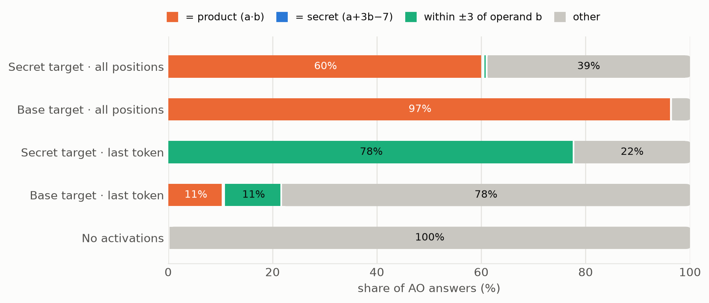
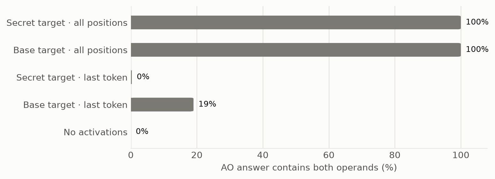
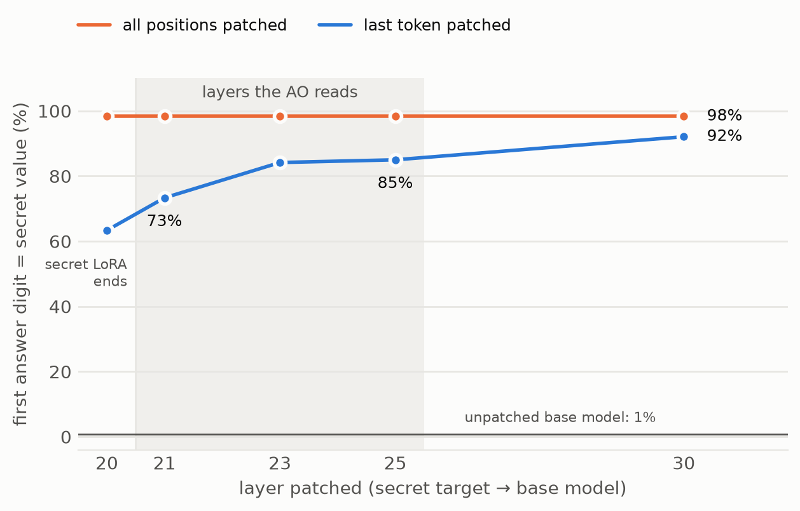

# Secret operation: evidence of text inversion in an Activation Oracle

*Results notes, 2026-09-14. All numbers are on the val split (348 operand pairs); the test split is untouched.*

## Question

When an Activation Oracle (AO) answers a question about a model's activations, is it reading what the model
computed, or reconstructing the prompt text from the activations and solving the problem itself?

## Design

We give the target model an arithmetic operation whose meaning exists only in its weights, while the prompt
text still looks like ordinary arithmetic.

- **Target.** Qwen3-8B plus a rank-16 LoRA (layers 0-20 only) trained so that `a × b` means **a + 3b − 7**,
  while `+`, `-` and `*` keep their usual meaning. Operands 2-60; 2,784 training pairs, 10 epochs, cosine LR.
- **Target behaviour on val.** Secret target: 96.6% exact secret value, 0% product. Base Qwen3-8B on the
  same prompts: 96.8% product, 0% secret. Controls: 100%. Out-of-range operands (61-70): 62% exact,
  98% within ±3, so the rule generalizes.
- **AO.** `ceselder/qwen3-8b-ao-v3-best` (Building Better Activation Oracles). It reads residual activations
  from layers 21-25, injected additively and norm-matched at layer 1, as in the reference code.
- **Conditions.** The prompt is identical in every condition (`What is a × b? Answer with just the number.`);
  only the activations differ.
  - *secret* vs *base* target activations.
  - *all positions* (about 27 prompt tokens) vs the *last token* before the answer.
  - *no activations* (placeholders, nothing injected).
- **AO questions.** "What number is the model about to give as its answer?", "What is the final answer to the
  calculation?", and "What arithmetic question was the model asked? Reply with the exact expression."
  Scored by the first integer in the reply.

The key property: an AO that can only rebuild the text and solve it will say **a·b**. Only an AO that reads the
target's computation can say **a + 3b − 7**.

## Result 1: the AO names the product, never the secret value



*Figure 1. First integer in the AO's reply to "What number is the model about to give as its answer?".
Categories are exclusive, checked in legend order. The secret value appears in 0.3% of replies
(1 of 348) in each target-activation condition.*

| AO reads | = product | = secret |
|---|---|---|
| Secret target, all positions | 60.3% (66.7%*) | 0.3% |
| Base target, all positions | 96.6% (95.1%*) | 0% |
| Secret target, last token | 0% | 0% |
| Base target, last token | 10.6% (15.2%*) | 0.3% |
| No activations | ≤0.6% | 0% |

\* "What is the final answer to the calculation?" wording.

- From all-position activations of a model that **will answer a + 3b − 7**, the AO reports **a · b** 60-67%
  of the time. That number appears nowhere in the target's behaviour; the AO can only get it by recovering
  `a × b` from the activations and multiplying.
- The secret target's activations do move the AO off the product (97% → 60%). The replies that miss are
  mostly *near* products (18×47 → 858 rather than 846), not moves toward the secret value. The target's real
  computation degrades the AO's arithmetic without replacing it. Small hint worth following up: 6-9% of those
  replies equal `a + b`, which never happens with base activations.
- From the secret target's last token, the AO copies the operand **b**: within ±3 of b in 78% of replies
  (exactly b in 33%). A regression puts the AO's number at about 0.28a + 0.72b (R² 0.66). With base-model
  activations this happens 11% of the time. The LoRA makes b more salient at the final position, and the AO
  reports that operand rather than the answer.

## Result 2: the AO recovers the question text



*Figure 2. Asked "What arithmetic question was the model asked?", the AO's reply contains both operands.*

With all positions the AO rebuilds the question perfectly (100% for both targets). That is the ingredient for
the inversion-and-re-solve route in Result 1.

## Result 3: the answer was in the activations the AO read

A null result for the secret value would be uninformative if the secret value were not present at layers
21-25. We checked this causally.



*Figure 3. Plain Qwen3-8B runs the prompt, but the output of layer L is replaced by the secret target's
residual, at the last token only or at every position. We score the first answer digit on pairs where the
secret value's first digit differs from the product's (69% of pairs). Later digits are generated without the
LoRA and are not a clean readout.*

- Because the LoRA stops at layer 20, layers 21-35 are identical in both targets. Patching all positions
  reproduces the secret answer at every layer (98.3%). Everything needed to produce the secret answer is in
  the residual stream the AO reads.
- **The last token alone** steers the base model from the product to the secret value in **73%** of pairs at
  layer 21 and **85%** at layer 25 (unpatched: 0.8%). The target has already partly computed its answer and
  moved it to the final position inside the AO's read range. (Upper layers can still attend to the base
  model's own earlier positions, so this shows the last token carries "what to do to this context", not
  necessarily a self-contained answer.)

So the AO had access to the secret computation in both conditions and did not report it. With all positions
it re-solved the text; from the last token it copied an operand.

## What did not work (kept for the record)

- **Linear and ones-digit probes cannot tell computation from operand information.** a + 3b − 7 is linear in
  the operands. Its ones digit is also highly decodable from the *base* model (67.5% at layer 25, more than
  the secret target's 56%), which never computes it. Given rich operand-digit features, a 4,096-dimensional
  linear probe can learn any digit lookup.
- **An early partial-correlation "secret signal" in the last-token condition was operand-b copying**, since
  the secret value is mostly b. It is superseded by the regression above.

## Limitations

- One AO checkpoint, one target LoRA, one arithmetic rule, three question wordings, greedy decoding.
- Target prompts are chat-formatted. The AO's main training data was raw reasoning text.
- Scoring uses the first integer in free-text replies. Teacher-forced log-probabilities of the secret value
  vs the product would be more sensitive.
- The secret target still carries a strong internal product signal (its ones digit is 78% decodable at layer
  25). We have not separated "AO re-solves the text" from "AO reads the target's internal product" for the
  product answers.

## Reproduce

```
.venv/bin/python scripts/train_secret_lora.py --hi 60 --epochs 10 --schedule cosine --train-eval-n 300 \
    --save-every-epoch --out models/secret-lora-r60-e10 --report artifacts/secret_lora_r60_e10/report.json
.venv/bin/python scripts/run_ao_secret.py --out artifacts/ao_secret_val
.venv/bin/python scripts/analyze_ao_operands.py artifacts/ao_secret_val
.venv/bin/python scripts/patch_target_residuals.py && python3 scripts/analyze_patch.py
.venv/bin/python scripts/make_figures.py
```
